# CPWeather

CPWeather is a Perak-focused weather dashboard built for the things that actually affect local plans: haze, sudden rain, live warnings, and whether today still feels safe for an outdoor trip.

The current experience is a clean solid-surface dashboard with Tapah as the default view, a full-page Sandy Loading Lottie startup state, a live temperature hero, a vertical 5-day forecast, a forecast chart, warning detail, air-quality status, and a hiking recommendation that explains itself.

## Presentation Summary

- Problem: generic weather apps do not answer local questions like haze risk, rain timing, and "should I still go out today?"
- Solution: combine OpenWeather and Malaysia weather data into one frontend dashboard with a practical decision layer.
- Frontend signal: React, TypeScript, Tailwind, Chart.js, fetch, responsive layout, local caching, API normalization.
- Product signal: clear hierarchy, live data, explainable hiking verdict, graceful fallback behavior.

## What A User Can Do In The App

- Open the dashboard and immediately see the latest Tapah weather briefing.
- Switch between supported Perak locations including Tapah, Ipoh, Taiping, Lumut, Gopeng, Gerik, Kampong Gajah, Sungkai, and Teluk Intan.
- View the current temperature, overview, and next rain window.
- Check AQI and pollutant-related outdoor comfort.
- Read location-specific warning cards from Malaysia weather data.
- See a 5-day forecast sidebar and a forecast chart.
- Get a hiking verdict such as `Go`, `Caution`, or `Skip`.
- Read the reasons behind the hiking verdict through cue chips and explanation text.
- Refresh the dashboard manually if needed.
- Continue using recent cached data if a live request temporarily fails.

## Simple User Flow

1. The user opens the app.
2. The frontend checks `localStorage` for a recent dashboard payload for the selected location.
3. If fresh cached data exists, it renders immediately.
4. The frontend then fetches `/api/dashboard?location=...`.
5. The backend combines live weather providers into one shared response.
6. The frontend renders the dashboard cards, chart, warnings, and hiking tip.
7. The latest payload is written back to cache for the next visit.

## Simple Developer Flow

1. The frontend calls `/api/dashboard`.
2. [api/dashboard.ts](./api/dashboard.ts) validates the request and hands work to the service layer.
3. [api/dashboardService.ts](./api/dashboardService.ts) fetches:
   - OpenWeather forecast
   - OpenWeather air pollution
   - Malaysia forecast
   - Malaysia warnings
4. The service normalizes those sources into the shared contract in [src/shared/dashboard.ts](./src/shared/dashboard.ts).
5. The service computes:
   - `currentTemp`
   - `overview`
   - `nextRainWindow`
   - `warning feed`
   - `hikeTip`
6. The frontend in [src/App.tsx](./src/App.tsx) renders one stable payload shape, without caring which provider produced each field.
7. [src/lib/dashboardCache.ts](./src/lib/dashboardCache.ts) stores the response locally for a 15-minute TTL.

## System Flow

```mermaid
flowchart LR
  A["User opens dashboard"] --> B["Frontend loads App.tsx"]
  B --> C{"Fresh local cache exists?"}
  C -- Yes --> D["Render cached dashboard"]
  C -- No --> E["Fetch /api/dashboard?location=..."]
  D --> E
  E --> F["api/dashboard.ts validates location"]
  F --> G["api/dashboardService.ts aggregates providers"]
  G --> H["OpenWeather forecast + air"]
  G --> I["Malaysia forecast + warnings"]
  H --> J["Normalize into DashboardPayload"]
  I --> J
  J --> K["Compute temp, rain window, warnings, hike tip"]
  K --> L["Return shared payload"]
  L --> M["Frontend renders dashboard"]
  M --> N["Save payload into localStorage cache"]
```



## Current Features

- React + TypeScript + Vite app scaffolded and working.
- Tailwind CSS integrated through Vite.
- Solid, accessible dashboard interface with restrained motion and clear interactive states.
- Full-page Sandy Loading Lottie loading screen using a local JSON asset.
- Tapah-first landing experience with live hero temperature.
- Vertical 5-day forecast sidebar.
- Forecast chart using Chart.js.
- Live warning feed panel.
- Air-quality widget and rain window widget.
- True current-weather temperature and summary from OpenWeather.
- Shared typed dashboard contract used by frontend and backend.
- `/api/dashboard` route for unified data access.
- Malaysia forecast and warning integration.
- OpenWeather forecast and air-pollution integration.
- Explainable hiking verdict logic based on warnings, AQI, and rain timing.
- `localStorage` caching with a 15-minute TTL and stale fallback behavior.
- Dashboard fetch/cache logic extracted into a dedicated React hook.
- Main dashboard UI split into focused components instead of one large page file.
- Loading, error, retry, and empty-state handling.
- Vitest coverage for payload validation, normalization outcomes, and hiking decisions.
- `pnpm lint` passing.
- `pnpm test` passing.
- `pnpm build` passing.

## Current Locations

- Tapah
- Ipoh
- Taiping
- Lumut
- Gopeng
- Gerik
- Kampong Gajah
- Sungkai
- Teluk Intan

## Current Dashboard Sections

- Main weather hero
- Hiking outlook card
- Air quality widget
- Rain window widget
- Warning summary widget
- 5-day forecast sidebar
- Forecast trend chart
- Live warning feed

## Asset Credits

- Loading animation: Sandy Loading by Parsa Navaei, sourced from LottieFiles and stored locally as [src/assets/sandy-loading.json](./src/assets/sandy-loading.json).

## API Route

Supported requests:

```text
GET /api/dashboard
GET /api/dashboard?location=tapah
GET /api/dashboard?location=ipoh
GET /api/dashboard?location=taiping
GET /api/dashboard?location=lumut
```

Current behavior:

- defaults to `tapah` if no location is provided
- returns one normalized dashboard payload
- can return `mock`, `hybrid`, or `live` in `meta.source`
- rejects unsupported locations with `400 INVALID_LOCATION`
- rejects non-GET requests with `405 METHOD_NOT_ALLOWED`

## Shared Data Contract

The shared response shape lives in [src/shared/dashboard.ts](./src/shared/dashboard.ts).

The important top-level fields are:

- `locationKey`
- `locations`
- `snapshot`
- `meta`

The important `snapshot` fields are:

- `label`
- `district`
- `currentTemp`
- `overview`
- `nextRainWindow`
- `aqi`
- `airBand`
- `pollutants`
- `hikeTip`
- `warnings`
- `forecast`

This shared contract is important because it keeps the UI stable even when provider logic changes behind the scenes.

## Tech Stack

- React 19
- TypeScript
- Vite
- Tailwind CSS
- Chart.js
- react-chartjs-2
- fetch API
- dayjs
- localStorage caching

## Key Files

```text
CPWeather/
|-- api/
|   |-- dashboard.ts
|   |-- dashboardService.ts
|   |-- dashboardService.test.ts
|   `-- locationConfig.ts
|-- src/
|   |-- components/
|   |   `-- dashboard/
|   |-- hooks/
|   |   `-- useDashboard.ts
|   |-- lib/
|   |   `-- dashboardCache.ts
|   |-- shared/
|   |   `-- dashboard.ts
|   |   `-- dashboardValidation.ts
|   |-- App.tsx
|   |-- index.css
|   `-- mockData.ts
|-- vite.config.ts
|-- vitest.config.ts
|-- .env.example
`-- readme.md
```

## Data Sources

- OpenWeather 5-day forecast
- OpenWeather current weather
- OpenWeather air pollution
- Malaysia forecast data
- Malaysia warning data

## Setup

### Requirements

- Node `22.12.0`
- `pnpm`
- PowerShell on Windows

### Install

```powershell
pnpm install
```

### Run Dev Server

```powershell
pnpm dev
```

### Lint

```powershell
pnpm lint
```

### Test

```powershell
pnpm test
```

### Build

```powershell
pnpm build
```

### Live Hosting (Wrangler)

Login and set your production secret:

```powershell
pnpm wrangler login
pnpm wrangler secret put OPENWEATHER_API_KEY
```

Preview locally using the same worker + assets routing:

```powershell
pnpm preview:live
```

Deploy to live Cloudflare Workers hosting:

```powershell
pnpm deploy:live
```

## Environment Variables

Create a local env file:

```text
.env.local
```

Set:

```text
OPENWEATHER_API_KEY=your_real_key_here
```

Important:

- keep the real key in `.env.local`, not `.env.example`
- do not expose it through `VITE_*`
- restart `pnpm dev` after env changes

## Cache Behavior

- cache lives in `localStorage`
- TTL is 15 minutes
- cache key version is currently `v4`
- fresh cache renders immediately
- fresh and stale cache both revalidate in the background
- stale cache can still be shown if a live fetch fails

## Hiking Decision Logic

The hiking tip is not random UI text. It is derived from:

- location-specific warning relevance
- warning severity and timing
- near-term rain timing
- thunderstorm risk
- AQI / air-band comfort

Current verdicts:

- `Go`
- `Caution`
- `Skip`

The UI also shows cue chips so the user can understand why that verdict was chosen.

## What Is Still Missing

- Cloudflare dashboard polish (custom domain + route rules)
- mobile QA and cross-browser QA
- README screenshots and provider attribution polish
- optional stretch features:
  - Supabase user preferences
  - i18next
  - PWA support

## Recommended Next Order

1. Test the full dashboard carefully on phone and desktop.
2. Deploy with Wrangler and set production secrets.
3. Add screenshots and attribution.
4. Verify live Cloudflare deployment behavior and API fallback paths.
5. Only after the MVP is stable, decide on Supabase, i18n, and PWA.

## Things Not To Forget

- Use Node 22, not Node 18.
- `.env.example` is only a template.
- Put the real OpenWeather key in `.env.local`.
- Restart the dev server after changing env vars.
- Hard refresh the browser after major cache-shape changes.
- Do not commit secrets.
- Keep the shared contract stable when changing backend logic.
- Test mobile layout, not just desktop.
- Add provider attribution before shipping publicly.
